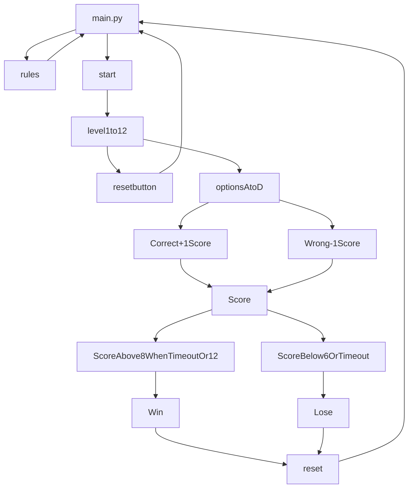

# Movie Guessing Quiz
## Summary
The goal of the game is to guess the movie through the usage of 2-4 emojis that will be displayed on the polarizer motherframe! 
Select the correct answer from 4 choices and get the highest score possible which is 22! 

Every correct answer gives the player 1 point to their score while every wrong answer deducts 1 point from their score.

The conditions to win the game is to get a minimum of 8 points before the 5 minute timer ends or get every question correct and obtain 12 points. Getting every question correct will award the player an additional 10 points.

Otherwise, having less than 8 points when the 5 minute timer ends or getting a -6 score will be a game over.


### _Photo of Main GUI_

<br>
<br>


_Code Flowchart_

## Hardware Used
**Model of hardware:** Raspberry Pi 4 Model B

**Version:** Raspbian GNU Linux 10 Buster


### _Raspberry Pi Model_

## Features
The game features:
- 12 levels to play
- Score system
- 5 minute timer
- 4 choices to pick from for each question

## **Getting started**

To run this program, you need to install the following libraries on your Raspberry Pi
- MQTT Client
- pygame 

1. Open up your terminal

2. Installation of MQTT Client

```
sudo apt install paho-mqtt
```

3. Installation of pygame

```
sudo apt install pygame
```


## **How does the code work?**

The code is split into 4 frames that make up the entirety of the main GUI

- Libraries used 
- Frame 1: Game Title Header
- Frame 2: Level Select
- Frame 3: Main Menu (Start Button, Rules Button, Reset Button, Score Label and Timer Label)
- Frame 4: 4 Button Multiple Choices 


### _4 Frames that make up the GUI_


## **Libraries Used**

```
from tkinter import * 
from tkinter import messagebox
import paho.mqtt.client as mqtt
from student_pub import pubpic 
import pygame
from pygame import *

main = Tk()
main.title("Guess the Movie Emoji Quiz")
```

**tkinter** is used for building the GUI which includes the frames, buttons, labels, message box and titles. 

**paho.mqtt.client** is used to let your raspberry pi publish a MQTT message to a broker which is the gateway Raspberry pi through wifi IP

**pubpic** is a function referenced from **student_pub** which can be called to send a set color value to a pixel in the grid of the polariser mother frame to draw a picture represented through white, black and shades of grey using numbers from 0 to 7. 0 is white and it gradually goes darker till it reaches 7 which is black.

**pygame** is used for the pygame.mixer.music module which will play the sound effects of the game. 

## **Frame 1: Game Title Header**


### _Frame 1_


```
frame1 = Frame(main)
frame1.grid(row=0, columnspan=2)

header = Label(frame1, text="Guess the movie!", font=("Arial",100))
header.grid(row=0, columnspan=3) 
```

The frame spans 3 column spaces starting from column 0 and is in the first row which is row 0.

Frame 1 consists of the title header is a label which shows the text "Guess the movie!" at the top of the main GUI. 

## **Frame 2: Level Select**


### _Frame 2_

``` 
frame2 = Frame(main)
frame2.grid(rowspan=2, column=0)

```

Frame 2 spans 2 rows starting from row 0 and in column 0. 

Frame 2 also consists of 12 buttons that represent the 12 levels on the level select and 12 functions that is attached to each button in order to start a level.

An example of the button function for the 1st level is shown below:

```
#Frozen
def one_pressed():
    pubpic([[0, 0, 0, 0, 0, 0, 0, 0, 0, 0, 0, 0, 0, 0, 0, 0, 0, 0, 0, 0, 0, 0, 0, 0, 0, 0, 0, 0, 0, 0, 0, 0], [0, 0, 0, 0, 0, 0, 6, 6, 6, 6, 0, 0, 0, 0, 0, 0, 0, 0, 0, 0, 0, 0, 0, 0, 7, 7, 0, 0, 0, 0, 0, 0], [0, 0, 7, 7, 4, 7, 6, 6, 6, 6, 0, 0, 0, 0, 0, 0, 0, 0, 0, 0, 0, 0, 7, 4, 7, 7, 4, 7, 0, 0, 0, 0], [0, 0, 4, 4, 7, 7, 6, 6, 6, 6, 7, 4, 4, 0, 0, 0, 0, 0, 0, 0, 7, 7, 0, 7, 4, 4, 7, 0, 7, 7, 0, 0], [0, 0, 0, 0, 0, 7, 2, 2, 2, 2, 7, 0, 7, 7, 0, 0, 0, 0, 0, 7, 7, 4, 0, 0, 7, 7, 0, 0, 4, 0, 7, 0], [0, 0, 7, 4, 0, 2, 2, 2, 2, 2, 2, 0, 7, 7, 0, 0, 0, 0, 0, 7, 4, 4, 0, 0, 7, 7, 0, 0, 4, 4, 7, 0], [0, 0, 0, 7, 7, 2, 6, 4, 2, 6, 2, 7, 4, 0, 0, 0, 0, 0, 7, 4, 4, 4, 4, 6, 7, 7, 7, 4, 4, 4, 4, 0], [0, 0, 0, 0, 7, 2, 2, 2, 2, 2, 2, 7, 4, 0, 0, 0, 0, 0, 7, 7, 0, 0, 7, 4, 4, 4, 4, 1, 0, 0, 7, 0], [0, 0, 6, 7, 0, 2, 2, 2, 2, 2, 7, 7, 7, 7, 0, 0, 0, 0, 0, 0, 0, 0, 0, 7, 4, 4, 7, 0, 0, 0, 0, 0], [0, 0, 0, 6, 3, 2, 2, 2, 2, 2, 2, 6, 7, 0, 0, 0, 0, 0, 7, 4, 4, 7, 4, 7, 7, 7, 6, 4, 7, 4, 4, 7], [0, 0, 0, 5, 2, 2, 2, 6, 2, 2, 2, 2, 0, 0, 0, 0, 0, 0, 0, 7, 4, 4, 0, 0, 7, 7, 0, 0, 4, 4, 1, 0], [0, 0, 0, 7, 2, 2, 2, 3, 2, 2, 2, 2, 0, 0, 0, 0, 0, 0, 0, 4, 7, 4, 0, 0, 7, 7, 0, 0, 4, 7, 4, 0], [0, 0, 0, 7, 2, 2, 2, 2, 2, 2, 2, 2, 0, 0, 0, 0, 0, 0, 0, 0, 7, 7, 0, 7, 4, 4, 6, 0, 5, 7, 0, 0], [0, 0, 0, 0, 2, 2, 2, 2, 2, 2, 2, 7, 0, 0, 0, 0, 0, 0, 0, 0, 0, 0, 7, 4, 7, 7, 4, 0, 0, 0, 0, 0], [0, 0, 0, 0, 0, 2, 2, 2, 2, 2, 7, 0, 0, 0, 0, 0, 0, 0, 0, 0, 0, 0, 0, 0, 7, 7, 5, 0, 0, 0, 0, 0], [0, 0, 0, 0, 0, 0, 0, 0, 0, 0, 0, 0, 0, 0, 0, 0, 0, 0, 0, 0, 0, 0, 0, 0, 0, 0, 0, 0, 0, 0, 0, 0], [0, 0, 0, 0, 0, 0, 0, 0, 0, 0, 0, 0, 0, 0, 0, 0, 0, 0, 0, 0, 0, 0, 0, 0, 0, 0, 0, 0, 0, 0, 0, 0], [0, 0, 0, 0, 0, 0, 0, 0, 0, 0, 0, 0, 0, 0, 0, 0, 0, 0, 0, 0, 0, 0, 6, 6, 6, 6, 0, 0, 0, 0, 0, 0], [0, 0, 0, 0, 0, 0, 0, 0, 0, 0, 0, 0, 0, 0, 0, 0, 0, 0, 0, 0, 0, 6, 6, 6, 6, 0, 0, 0, 0, 0, 0, 0], [0, 0, 0, 0, 0, 0, 0, 0, 0, 0, 0, 0, 0, 0, 0, 0, 0, 0, 0, 0, 6, 6, 6, 6, 6, 6, 0, 0, 0, 0, 0, 0], [0, 0, 0, 0, 0, 0, 0, 0, 0, 0, 0, 0, 0, 0, 0, 0, 0, 0, 0, 6, 6, 6, 6, 6, 6, 6, 6, 0, 0, 0, 0, 0], [0, 0, 0, 0, 0, 0, 0, 0, 0, 0, 0, 0, 0, 0, 0, 0, 0, 0, 6, 6, 6, 6, 6, 6, 6, 6, 6, 6, 0, 0, 0, 0], [0, 0, 0, 0, 0, 0, 0, 0, 0, 0, 0, 0, 0, 0, 0, 0, 0, 0, 6, 1, 4, 6, 4, 4, 4, 4, 1, 6, 1, 0, 0, 0], [0, 0, 0, 0, 0, 0, 0, 0, 0, 0, 0, 0, 0, 0, 0, 0, 0, 0, 6, 1, 4, 6, 4, 4, 4, 4, 1, 6, 0, 0, 0, 0], [0, 0, 0, 0, 0, 0, 0, 0, 0, 0, 0, 0, 0, 0, 0, 0, 0, 0, 0, 1, 4, 4, 4, 4, 4, 4, 1, 0, 5, 5, 0, 0], [0, 0, 0, 0, 0, 0, 0, 0, 0, 0, 0, 0, 0, 0, 0, 0, 0, 0, 0, 1, 4, 4, 5, 5, 4, 4, 2, 0, 0, 5, 0, 0], [0, 0, 0, 0, 0, 0, 0, 0, 0, 0, 0, 0, 0, 0, 0, 0, 0, 0, 0, 1, 2, 2, 4, 4, 3, 2, 1, 0, 5, 0, 0, 0], [0, 0, 0, 0, 0, 0, 0, 0, 0, 0, 0, 0, 0, 0, 0, 0, 0, 0, 0, 1, 6, 6, 5, 5, 6, 6, 1, 4, 4, 0, 0, 0], [0, 0, 0, 0, 0, 0, 0, 0, 0, 0, 0, 0, 0, 0, 0, 0, 0, 0, 6, 6, 6, 6, 6, 6, 6, 4, 6, 4, 4, 4, 0, 0], [0, 0, 0, 0, 0, 0, 0, 0, 0, 0, 0, 0, 0, 0, 0, 0, 0, 0, 6, 6, 4, 6, 6, 4, 6, 6, 6, 4, 4, 6, 0, 0], [0, 0, 0, 0, 0, 0, 0, 0, 0, 0, 0, 0, 0, 0, 0, 0, 0, 0, 0, 0, 0, 0, 0, 0, 0, 0, 0, 0, 0, 0, 0, 0], [0, 0, 0, 0, 0, 0, 0, 0, 0, 0, 0, 0, 0, 0, 0, 0, 0, 0, 0, 0, 0, 0, 0, 0, 0, 0, 0, 0, 0, 0, 0, 0]])
    global ans
    ans = 1
    one.config(fg='grey')
    OptionA.config(text="Little Mermaid")
    OptionB.config(text="Frozen")
    OptionC.config(text="Moana") 
    OptionD.config(text="Atlantis") 
    print("Button pressed is Lv 1")
```

An example of the button itself and its position in the grid is below:
```
one = Button(frame2, text="1", font=("Arial",50), command=one_pressed)
one.grid(row=0, column=0)
```

When the button for the 1st level is clicked, it will called the **one_pressed** function.

Firstly,  pubpic sends the values which draw an image through values from 0 to 7 that represent each pixel from 0 which is white to shades of grey to black which is 7. 


