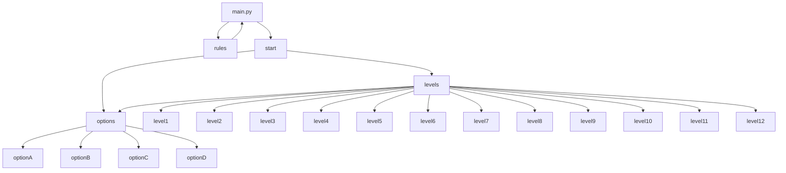

# MovieQuiz
### Summary
The goal of the game is to guess the movie through the use of 2-4 emojis that will be displayed on the polarizer motherframe! Select the correct answer from 4 choices and get the highest score possible which is 22! Every correct answer gives the player 1 point to their score while every wrong answer deducts 1 point from their score.

The conditions to win the game is to get a minimum of 8 points before the 5 minute timer ends or get every question correct and obtain 12 points. Getting every question correct will award the player an additional 10 points.

Otherwise, having less than 8 points when the 5 minute timer ends or getting 6 questions wrong will be a game over.


Photo of Main GUI



Code Flowchart
### Software Used
Name: Visual Studio Code

Version: 1.74 

## Features
The game features:
- 12 levels to play
- Score system
- 5 minute timer
- 4 choices to pick from for each question

## How to use?

To run this program, you need to install following libraries
- MQTT Client
- playsound 

Open up Command Prompt;

Installation of MQTT Client
```
pip3 install paho-mqtt
```

Installation of playsound
```
pip3 install playsound==1.2.2
```

## 
