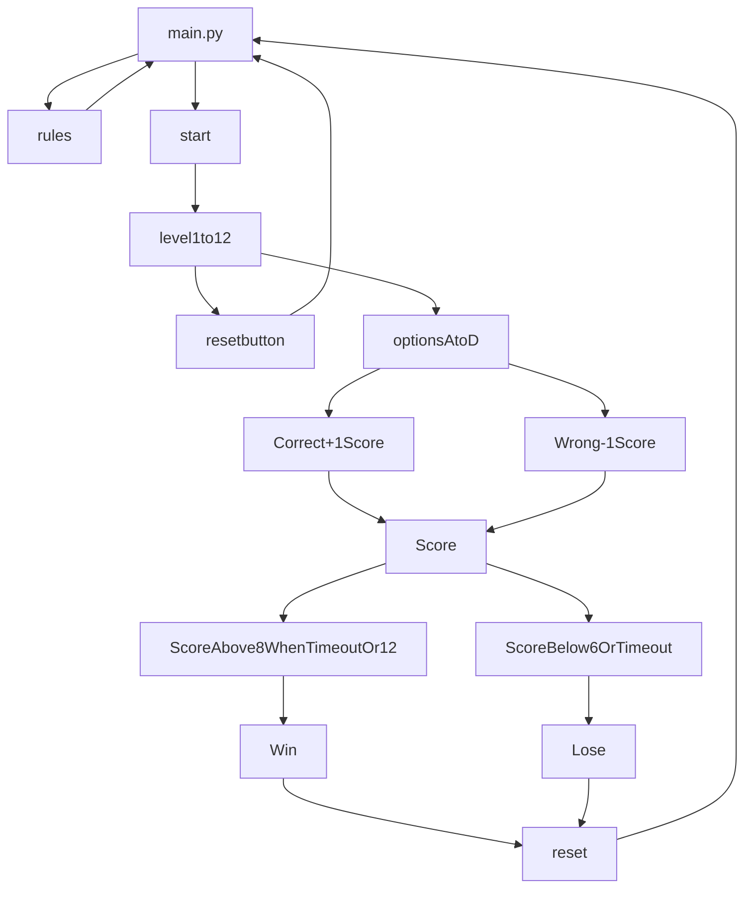

# Movie Guessing Quiz
## Summary
The goal of the game is to guess the movie through the usage of 2-4 emojis that will be displayed on the polarizer motherframe! 
Select the correct answer from 4 choices and get the highest score possible which is 22! 

Every correct answer gives the player 1 point to their score while every wrong answer deducts 1 point from their score.

The conditions to win the game is to get a minimum of 8 points before the 5 minute timer ends or get every question correct and obtain 12 points. Getting every question correct will award the player an additional 10 points.

Otherwise, having less than 8 points when the 5 minute timer ends or getting a -6 score will be a game over.


_Photo of Main GUI_

<br>
<br>


_Code Flowchart_

## Hardware Used
**Model of hardware:** Raspberry Pi 4 Model B

**Version:** Raspbian GNU Linux 10 Buster


## Features
The game features:
- 12 levels to play
- Score system
- 5 minute timer
- 4 choices to pick from for each question

## **Getting started**

To run this program, you need to install the following libraries on your Raspberry Pi
- MQTT Client
- pygame 

Open up your terminal

Installation of MQTT Client
```
sudo apt install paho-mqtt
```

Installation of pygame
```
sudo apt install pygame
```

## **How does the code work?**

The code is split into 4 frames that make up the entirety of the main GUI

- Frame 1: Game Title Header
- Frame 2: Level Select
- Frame 3: Main Menu (Start Button, Rules Button, Reset Button, Score Label and Timer Label)
- Frame 4: 4 Button Multiple Choices 

## Frame 1

```
frame1 = Frame(main)
frame1.grid(row=0, columnspan=2)

header = Label(frame1, text="Guess the movie!", font=("Arial",100))
header.grid(row=0, columnspan=3) 
```

Frame 1 consists of the title header is a label which shows the text "Guess the movie!" at the top of the main GUI which spans 3 column spaces starting from column 0 and is in the 1st row which is 0.


## Frame 2

