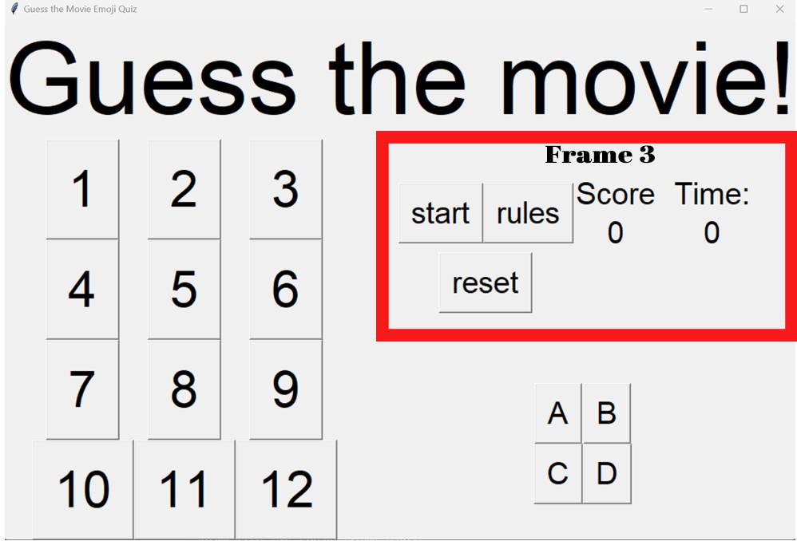

# Movie Guessing Quiz
## Summary
The goal of the game is to guess the movie through the usage of 2-4 emojis that will be displayed on the polarizer motherframe! 
Select the correct answer from 4 choices and get the highest score possible which is 22! 

Every correct answer gives the player 1 point to their score while every wrong answer deducts 1 point from their score.

The conditions to win the game is to get a minimum of 8 points before the 5 minute timer ends or get every question correct and obtain 12 points. Getting every question correct will award the player an additional 10 points.

Otherwise, having less than 8 points when the 5 minute timer ends or getting a -6 score will be a game over.


### _Photo of Main GUI_

<br>
<br>


_Code Flowchart_

## Hardware Used
**Model of hardware:** Raspberry Pi 4 Model B

**Version:** Raspbian GNU Linux 10 Buster


### _Raspberry Pi Model_

## Features
The game features:
- 12 levels to play
- Score system
- 5 minute timer
- 4 choices to pick from for each question


## Software Setup & Installation 

### PuTTy
After installing PuTTy, Change your desired **hostname** and **Connection Type** to "**SSH**" <br>
Input a name under **Saved Sessions** and click on save, the file will appear at the left hand side of the Settings. <br> 
Click the file once and load it. <br>
To finish it off, click **Open**.

 <br>
### _Photo of PuTTy Setup_


Enter your username and password. The default login for User is "pi" and the Password is "raspberry".

 <br>
### _Photo of PuTTy CMD_

To change your password, use the following command
``` 
sudo passwd
```

## 1. Updating of Raspberry Pi

```
sudo apt update
sudo apt upgrade
```

## 2. Configuring of Raspberry Pi
SSH is a network communication protocol that enables two computers to communicate and share data.
To **enable** SSH, type the following
```
sudo raspi-config
```

Select `3 Interface Options` <br>
Select `P2 SSH` <br>
**Enable SSH**

### Enabling Virtual Network Computing (VNC)
**VNC** is a cross-platform screen sharing system that can be used to remotely control another computer. 
<br>

To **enable** VNC, type the following
```
sudo raspi-config
```
Select `3 Interface Options` <br>
Select `P3 VNC` <br>
Select  **Enable VNC**

 <br>
### _VNC Setup_


## **Getting started**

To run this program, you need to install the following libraries on your Raspberry Pi
- MQTT Client
- pygame 

1. Open up your terminal

2. Installation of MQTT Client

```
sudo apt install -y mosquitto-clients
```

3. To run the script, please download 

```
sudo pip3 install pah-mqtt
```

if pip3 is not installed already please do the following

```
sudo apt install python3-pip
```

4. Installation of pygame

```
sudo apt install pygame
```

Afterwards, please type this in your terminal to clone the repository into your raspberry pi

```
git clone https://github.com/CallMeYuBing/EGL314MovieQuiz
```

Once the command is completed, use the following command to change the directory to the cloned repository

```
cd /home/pi/EGL314MovieQuiz
```

than open the game using this command

```
python3 main
```


## **How does the code work?**

The code is split into 4 frames that make up the entirety of the main GUI

- Libraries used 
- Frame 1: Game Title Header
- Frame 2: Level Select
- Frame 3: Main Menu (Start Button, Rules Button, Reset Button, Score Label and Timer Label)
- Frame 4: 4 Button Multiple Choices 


### _4 Frames that make up the GUI_


## **Libraries Used**

```
from tkinter import * 
from tkinter import messagebox
import paho.mqtt.client as mqtt
from student_pub import pubpic 
import pygame
from pygame import *
```

**tkinter** is used for building the GUI which includes the frames, buttons, labels, message box and titles. 

**paho.mqtt.client** is used to let your raspberry pi publish a MQTT message to a broker which is the gateway Raspberry pi through wifi IP

**pubpic** is a function referenced from **student_pub** which can be called to send a set color value to a pixel in the grid of the polariser mother frame to draw a picture represented through white, black and shades of grey using numbers from 0 to 7. 0 is white and it gradually goes darker till it reaches 7 which is black.

**pygame** is used for the pygame.mixer.music module which will play the sound effects of the game. 

## **Frame 1: Game Title Header**


### _Frame 1_


```
frame1 = Frame(main)
frame1.grid(row=0, columnspan=2)
header = Label(frame1, text="Guess the movie!", font=("Arial",100))
header.grid(row=0, columnspan=3) 
```

The frame spans 3 column spaces starting from column 0 and is in the first row which is row 0.

Frame 1 consists of the title header is a label which shows the text "Guess the movie!" at the top of the main GUI. 

## **Frame 2: Level Select**


### _Frame 2_

``` 
frame2 = Frame(main)
frame2.grid(rowspan=2, column=0)

```

Frame 2 spans 2 rows starting from row 0 and in column 0. 

Frame 2 also consists of 12 buttons that represent the 12 levels on the level select and 12 functions that is attached to each button in order to start a level.

An example of the button function for the 1st level is shown below:

```
#Frozen
def one_pressed():
    pubpic([[0, 0, 0, 0, 0, 0, 0, 0, 0, 0, 0, 0, 0, 0, 0, 0, 0, 0, 0, 0, 0, 0, 0, 0, 0, 0, 0, 0, 0, 0, 0, 0], [0, 0, 0, 0, 0, 0, 6, 6, 6, 6, 0, 0, 0, 0, 0, 0, 0, 0, 0, 0, 0, 0, 0, 0, 7, 7, 0, 0, 0, 0, 0, 0], [0, 0, 7, 7, 4, 7, 6, 6, 6, 6, 0, 0, 0, 0, 0, 0, 0, 0, 0, 0, 0, 0, 7, 4, 7, 7, 4, 7, 0, 0, 0, 0], [0, 0, 4, 4, 7, 7, 6, 6, 6, 6, 7, 4, 4, 0, 0, 0, 0, 0, 0, 0, 7, 7, 0, 7, 4, 4, 7, 0, 7, 7, 0, 0], [0, 0, 0, 0, 0, 7, 2, 2, 2, 2, 7, 0, 7, 7, 0, 0, 0, 0, 0, 7, 7, 4, 0, 0, 7, 7, 0, 0, 4, 0, 7, 0], [0, 0, 7, 4, 0, 2, 2, 2, 2, 2, 2, 0, 7, 7, 0, 0, 0, 0, 0, 7, 4, 4, 0, 0, 7, 7, 0, 0, 4, 4, 7, 0], [0, 0, 0, 7, 7, 2, 6, 4, 2, 6, 2, 7, 4, 0, 0, 0, 0, 0, 7, 4, 4, 4, 4, 6, 7, 7, 7, 4, 4, 4, 4, 0], [0, 0, 0, 0, 7, 2, 2, 2, 2, 2, 2, 7, 4, 0, 0, 0, 0, 0, 7, 7, 0, 0, 7, 4, 4, 4, 4, 1, 0, 0, 7, 0], [0, 0, 6, 7, 0, 2, 2, 2, 2, 2, 7, 7, 7, 7, 0, 0, 0, 0, 0, 0, 0, 0, 0, 7, 4, 4, 7, 0, 0, 0, 0, 0], [0, 0, 0, 6, 3, 2, 2, 2, 2, 2, 2, 6, 7, 0, 0, 0, 0, 0, 7, 4, 4, 7, 4, 7, 7, 7, 6, 4, 7, 4, 4, 7], [0, 0, 0, 5, 2, 2, 2, 6, 2, 2, 2, 2, 0, 0, 0, 0, 0, 0, 0, 7, 4, 4, 0, 0, 7, 7, 0, 0, 4, 4, 1, 0], [0, 0, 0, 7, 2, 2, 2, 3, 2, 2, 2, 2, 0, 0, 0, 0, 0, 0, 0, 4, 7, 4, 0, 0, 7, 7, 0, 0, 4, 7, 4, 0], [0, 0, 0, 7, 2, 2, 2, 2, 2, 2, 2, 2, 0, 0, 0, 0, 0, 0, 0, 0, 7, 7, 0, 7, 4, 4, 6, 0, 5, 7, 0, 0], [0, 0, 0, 0, 2, 2, 2, 2, 2, 2, 2, 7, 0, 0, 0, 0, 0, 0, 0, 0, 0, 0, 7, 4, 7, 7, 4, 0, 0, 0, 0, 0], [0, 0, 0, 0, 0, 2, 2, 2, 2, 2, 7, 0, 0, 0, 0, 0, 0, 0, 0, 0, 0, 0, 0, 0, 7, 7, 5, 0, 0, 0, 0, 0], [0, 0, 0, 0, 0, 0, 0, 0, 0, 0, 0, 0, 0, 0, 0, 0, 0, 0, 0, 0, 0, 0, 0, 0, 0, 0, 0, 0, 0, 0, 0, 0], [0, 0, 0, 0, 0, 0, 0, 0, 0, 0, 0, 0, 0, 0, 0, 0, 0, 0, 0, 0, 0, 0, 0, 0, 0, 0, 0, 0, 0, 0, 0, 0], [0, 0, 0, 0, 0, 0, 0, 0, 0, 0, 0, 0, 0, 0, 0, 0, 0, 0, 0, 0, 0, 0, 6, 6, 6, 6, 0, 0, 0, 0, 0, 0], [0, 0, 0, 0, 0, 0, 0, 0, 0, 0, 0, 0, 0, 0, 0, 0, 0, 0, 0, 0, 0, 6, 6, 6, 6, 0, 0, 0, 0, 0, 0, 0], [0, 0, 0, 0, 0, 0, 0, 0, 0, 0, 0, 0, 0, 0, 0, 0, 0, 0, 0, 0, 6, 6, 6, 6, 6, 6, 0, 0, 0, 0, 0, 0], [0, 0, 0, 0, 0, 0, 0, 0, 0, 0, 0, 0, 0, 0, 0, 0, 0, 0, 0, 6, 6, 6, 6, 6, 6, 6, 6, 0, 0, 0, 0, 0], [0, 0, 0, 0, 0, 0, 0, 0, 0, 0, 0, 0, 0, 0, 0, 0, 0, 0, 6, 6, 6, 6, 6, 6, 6, 6, 6, 6, 0, 0, 0, 0], [0, 0, 0, 0, 0, 0, 0, 0, 0, 0, 0, 0, 0, 0, 0, 0, 0, 0, 6, 1, 4, 6, 4, 4, 4, 4, 1, 6, 1, 0, 0, 0], [0, 0, 0, 0, 0, 0, 0, 0, 0, 0, 0, 0, 0, 0, 0, 0, 0, 0, 6, 1, 4, 6, 4, 4, 4, 4, 1, 6, 0, 0, 0, 0], [0, 0, 0, 0, 0, 0, 0, 0, 0, 0, 0, 0, 0, 0, 0, 0, 0, 0, 0, 1, 4, 4, 4, 4, 4, 4, 1, 0, 5, 5, 0, 0], [0, 0, 0, 0, 0, 0, 0, 0, 0, 0, 0, 0, 0, 0, 0, 0, 0, 0, 0, 1, 4, 4, 5, 5, 4, 4, 2, 0, 0, 5, 0, 0], [0, 0, 0, 0, 0, 0, 0, 0, 0, 0, 0, 0, 0, 0, 0, 0, 0, 0, 0, 1, 2, 2, 4, 4, 3, 2, 1, 0, 5, 0, 0, 0], [0, 0, 0, 0, 0, 0, 0, 0, 0, 0, 0, 0, 0, 0, 0, 0, 0, 0, 0, 1, 6, 6, 5, 5, 6, 6, 1, 4, 4, 0, 0, 0], [0, 0, 0, 0, 0, 0, 0, 0, 0, 0, 0, 0, 0, 0, 0, 0, 0, 0, 6, 6, 6, 6, 6, 6, 6, 4, 6, 4, 4, 4, 0, 0], [0, 0, 0, 0, 0, 0, 0, 0, 0, 0, 0, 0, 0, 0, 0, 0, 0, 0, 6, 6, 4, 6, 6, 4, 6, 6, 6, 4, 4, 6, 0, 0], [0, 0, 0, 0, 0, 0, 0, 0, 0, 0, 0, 0, 0, 0, 0, 0, 0, 0, 0, 0, 0, 0, 0, 0, 0, 0, 0, 0, 0, 0, 0, 0], [0, 0, 0, 0, 0, 0, 0, 0, 0, 0, 0, 0, 0, 0, 0, 0, 0, 0, 0, 0, 0, 0, 0, 0, 0, 0, 0, 0, 0, 0, 0, 0]])
    global ans
    ans = 1
    one.config(fg='grey')
    OptionA.config(text="Little Mermaid")
    OptionB.config(text="Frozen")
    OptionC.config(text="Moana") 
    OptionD.config(text="Atlantis") 
    print("Button pressed is Lv 1")
```

An example of the button itself and its position in the grid is below:
```
one = Button(frame2, text="1", font=("Arial",50), command=one_pressed)
one.grid(row=0, column=0)
```

When the button for the 1st level is clicked, it will called the **one_pressed** function.

**pubpic** sends the values which draw an image through values from 0 to 7 that represent each pixel in the grid from 0 which represents white to shades of grey which are 1 to 6 to black which is 7. 

The Option A to Option D **button.config** changes the text of the 4 choices that are specific to each level as well as changing the foreground color of the button to grey when it is clicked to signify that the level has been clicked before so players can easily tell if they have done the level around.

Global variable **ans** is called and set to 1 as 1 is the correct answer for level 1 which represents button **OptionB**. **ans** checks if the correct option is clicked by the player by rewarding a point through a 4 check functions that are for the 4 available choices. The check() functions will be elaborated further in Frame 4.

Button **one** is in row 0 and column 0 in the 3x4 grid inside frame 2. Button starts from button **one** and ends at button **tweleve**, starting from left to right than top to bottom.

## **Frame 3: Main Menu (Start Button, Rules Button, Reset Button, Score Label and Timer Label)**


### _Frame 3_ ##
```
frame3 = Frame(main)
frame3.grid(row=1, column=1)

points = 0
ans = 0
```

Frame 3 is in row 1 and column 1 of the main GUI. 
variable **points** and **ans** is set to 0 by default when the game is first booted up.

```
StartBtn = Button(frame3, text="start", font=("Arial",30), command=StartBtnTimer)
ResetBtn = Button(frame3, text="reset",font=("Arial",30),command=ResetBtn_pressed)
RulesBtn = Button(frame3, text="rules", font=("Arial",30), command=RulesBtn)
ScoreTxt = Label(frame3,font=("Arial",30), text="Score")
Score = Label(frame3, font=("Arial",30), text="0")
TimerTxt = Label(frame3, font=("Arial",30),text="Time:", padx=20)
Timer1 = Label(frame3, font=("Arial",30), text="0", padx=20)

StartBtn.grid(row=0,rowspan=2,column=0)
ResetBtn.grid(row=2, column=0, columnspan=2)
RulesBtn.grid(row=0,rowspan=2,column=1)
ScoreTxt.grid(row=0,column=2)
Score.grid(row=1,column=2)
TimerTxt.grid(row=0,column=3)
Timer1.grid(row=1,column=3)
```

Frame 3 consists of the Start Button, Reset Button, Reset Button and labels for the Score and Timer. 

### **Start Button**

When the start button is clicked, the following function is called: 

```
def StartBtnTimer():
    StartBtn_pressed()
    Timer()
```

It consists of the following 2 functions which are **StartBtn_pressed()** and **Timer()** and calls them in that order. 

```
def StartBtn_pressed():
    global points
    global time
    global roundover
    Click()
    points = 0
    time = 300
    roundover = False
    Score.config(text=points)
    Timer1.config(text=str(time))
    print("Button pressed is start")
```

StartBtn_pressed() when called will set variable **points** which is the score to 0 and sets variable **time** to 300 seconds which is the 5 minute timer.

It will also update the **Score** and **Timer1** label through the use of label.config to sync up with the **points** and **time** values and display them on the label on the GUI for the player to view.

**roundover** is a True/False Boolean value that checks whether the player is starting a new round or not in order not to activate the GameCondition() function prematurely if the player just started the game which will activate the conditions by default. Starting the game will set **roundover** to False so the GameCondition() function is able to check that **roundover** is False and will not activate the Win/Loss messagebox. 

**Click()** is a function which calls for a sound effect file from the 'SFX/Click.mp3' directory when clicking buttons which have this function.

``` 
def Click():
    pygame.mixer.init()
    pygame.mixer.music.load('SFX/Click.mp3')
    pygame.mixer.music.play()
````

Meanwhile, below is the Timer() function which is called alongside StartBtn_pressed() when the Start Button is pressed: 

```
def Timer():
    global time
    time = time-1
    if time <= 0 : 
        return
    Timer1.config(text=str(time))
    Timer1.after(1000,Timer)
```

The global variable **time** is set to 300 through the StartBtn_pressed() function where time is set to 300 and the value is brought over to the variable in the **Timer()** function. The time value is decreased every 1 second through

 ```
 time = time-1 
 ``` 
and 
 ```
 Timer1.after(1000,Timer)
 ```  

which will activate various messageboxes through the GameCondition() based on the value of time. 

Below is the function for GameCondition():
```
def GameCondition():
    global time
    global points
    global roundover

    if time == 0 and points < 8 and roundover == False: 
        messagebox.showinfo("Lose", "You lose! Timeout! Your score is " + str(points))
        roundover == True
        ResetBtn_pressed()
    
    elif points >= 8 and time == 0 and roundover == False: 
        messagebox.showinfo("Win","You win! Good luck on getting all 12 correct next time! Your score is " + str(points)) 
        ResetBtn_pressed()
    
    elif points == 12 and roundover == False: 
        points = points + 10
        messagebox.showinfo("Win","You got everything correct! Your score is " + str(points))
        roundover == True
        ResetBtn_pressed()
    
    elif points <= -5 and roundover == False:
        messagebox.showinfo("Lose","You lose! You got too many wrong answers! Your score is " + str(points))
        roundover == True
        ResetBtn_pressed()
    
    
    main.after(1000,GameCondition)

```

The function basically runs in the background as 

``` 
main.after(1000,GameCondition)
```
and updates every 1 second as a callback function at the end of the code to always check if the player has hit any of the following 4 conditions which result in a Win or a Loss. 

The conditions in the function which activate a win or loss are as follows:


1. If timer runs out, points is less than 8 and roundover is set to False: 
A messagebox will show the player has lost and display their score while setting the roundover value to True so that the GameCondition() will not activate again even when the game is over.

2. If timer runs out, points is more than or equal to 8 and roundover is set to False: 
A messagebox will show the player has won and display their score while setting the roundover value to True so that the GameCondition() will not activate again even when the game is over.

3. If the points is equal to 12 and roundover is set to False: 
A messagebox will show the player has answered all the questions correctly and won, displaying their score while setting the roundover value to True so that the GameCondition() will not activate again even when the game is over.

4. If the points is less than or equal to -5 and roundover is set to False: 
A messagebox will show the player has gotten at least 5 questions wrong and lost, displaying their score while setting the roundover value to True so that the GameCondition() will not activate again even when the game is over.


Next, the ResetBtn_pressed function:

```
def ResetBtn_pressed():
    global points
    global time
    global roundover 
    points = 0 
    time = 0
    roundover = True
    one.config(fg='black')
    two.config(fg='black')
    three.config(fg='black')
    four.config(fg='black')
    five.config(fg='black')
    six.config(fg='black')
    seven.config(fg='black')
    eight.config(fg='black')
    nine.config(fg='black')
    ten.config(fg='black')
    eleven.config(fg='black')
    twelve.config(fg='black')
    Score.config(text=points)
    Timer1.config(text=str(time))
    print("Button pressed is reset")
```

This function is basically a reset button that will manually reset all values such as the time and points to zero, set roundover to True and reset all the foreground color of the buttons back to its default color if the player wishes to end the game early where GameCondition() did not activate to naturally end the game. 

## **Frame 4: 4 Button Multiple Choice**

```
frame4 = Frame(main)
frame4.grid(row=2, column=1)

```

Frame 4 is in row 2 and column 1 of the main GUI. 

Frame 4 consists of the 4 buttons which represent the 4 available answers the player can select. 


### _Frame 4_

```
OptionA = Button(frame4, text="A", font=("Arial",30),command=Check0)
OptionB = Button(frame4, text="B", font=("Arial",30),command=Check1)
OptionC = Button(frame4, text="C", font=("Arial",30),command=Check2)
OptionD = Button(frame4, text="D", font=("Arial",30),command=Check3)

OptionA.grid(row=0, column=0)
OptionB.grid(row=0, column=1)
OptionC.grid(row=1, column=0)
OptionD.grid(row=1, column=1)

```

The 4 buttons are set in a 2x2 grid from left to right, top to bottom. Each button has a Check function corresponding th the option number that they are. 
It checks the **ans** variable which is set to the value representing the correct answer in the function attached to the buttons in the level select. 

Thus if for example OptionA is the correct answer, Check0() will check if ans==0, if the condition is true than the player receives 1 point added to their score and an image of a green tick is shown. 

On the other hand, if the condition is false than the player has 1 point deduct from their score and an image of a red X is shown. 

The sound effect for a correct answer is this function: 

def Correct():
    pygame.mixer.init()
    pygame.mixer.music.load('SFX/Correct.mp3')
    pygame.mixer.music.play()

The sound effect for a wrong answer is this function:

def Wrong():
    pygame.mixer.init()
    pygame.mixer.music.load('SFX/Wrong.mp3')
    pygame.mixer.music.play() 

These functions are located inside all 4 of the Check() functions.

### _How to open the file?_

